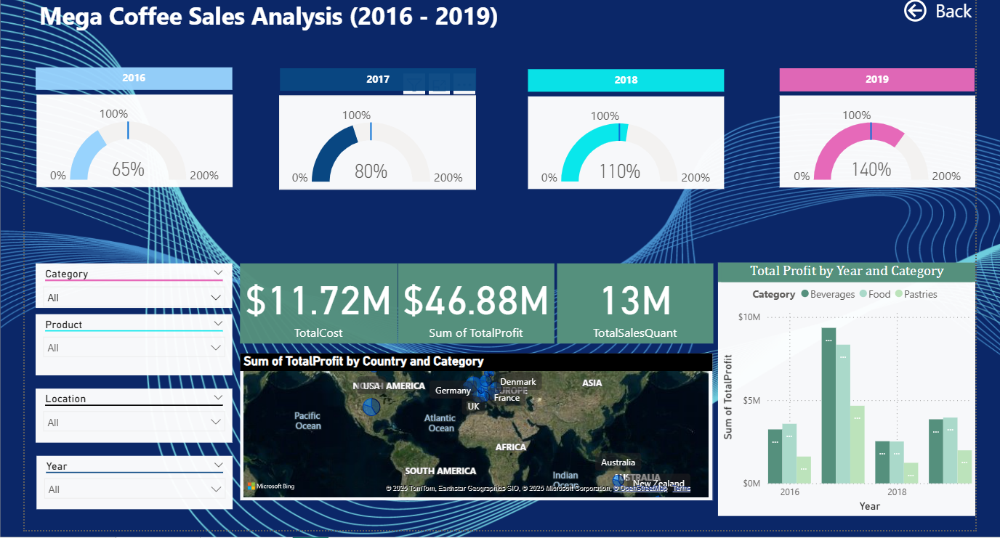
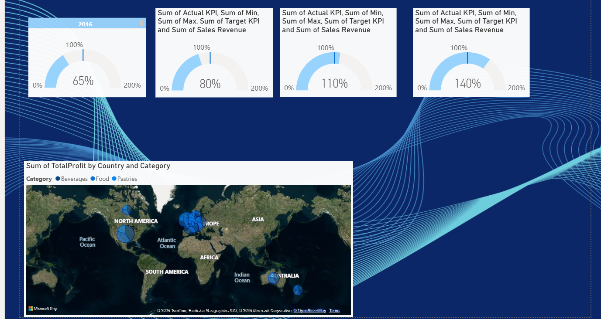

# Introduction

A comprehensive Power BI report built to analyze key business metrics, uncover insights, and support data-driven decision-making. This project includes an interactive dashboard, multiple data visuals, and a structured data model optimized for performance and usability.

## Dashboard File
You can find the file for the dashboard here:
[This is a Power BI report](./PowerBI_Dashboards.pbix)

### Skills Showcased
This project put key Power BI features into practice. Here's what we mastered:
-  🎨 **Dashboard Design:** Crafting an intuitive and visually appealing report layout.
- ⚙️ **Power Query ETL:** Performing data cleaning, shaping, and transformation.
- 🔗 **Data Modeling:** Building efficient data models with relationships (Star Schema principles).
- 🧮 **DAX Fundamentals:** Creating calculations and aggregations to derive key insights.
- 📊 **Visualizations Utilized:**
- 📈 **Core Charts:** Column, Bar, Line, and Area charts for comparisons and trends.
- 🗺️ **Map Charts:** For displaying geospatial data.
- 🔢 **Cards:** To highlight key performance indicators.
- 📋 **Tables:** For presenting detailed, tabular information.
- 🎨 **Chart Variety:** Selecting from common and uncommon chart types for effective storytelling.
- 🖱️ *Interactive Features:*
- 🎚️ *Slicers: Enabling dynamic, user-driven data filtering.*
- 🔘 **Buttons & Bookmarks:** For streamlined navigation and managing report views (including Drill-Through).

# Dashboard Overview

This report is split into two distinct pages to provide both a high-level summary and a detailed analysis.

Page 1: high-level summary

This Power BI dashboard analyzes Mega Coffee’s sales from 2016 to 2019. It presents yearly KPIs, total profit, cost, and sales quantities, with interactive filters. The visuals show profit trends by category and country, helping identify the most profitable regions and product categories.

Page 2: a detailed analysis

A global performance snapshot displaying yearly KPI achievements (2016–2019) and a map showing total profit distribution by country and category. It reveals a strong international market presence and increasing KPI performance over time.

## Conclusion

This Power BI project delivers a clear and insightful analysis of Mega Coffee’s sales performance from 2016 to 2019. The dashboard reveals steady KPI improvement, strong global profitability, and meaningful category-level insights, demonstrating effective use of Power BI for business intelligence.
